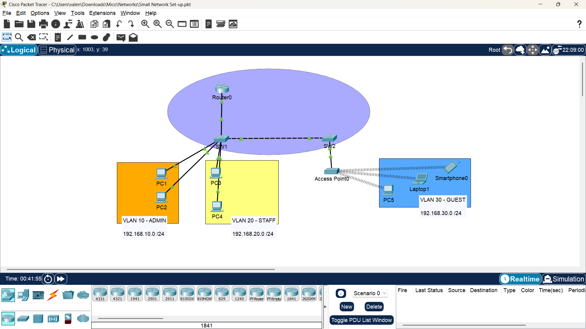
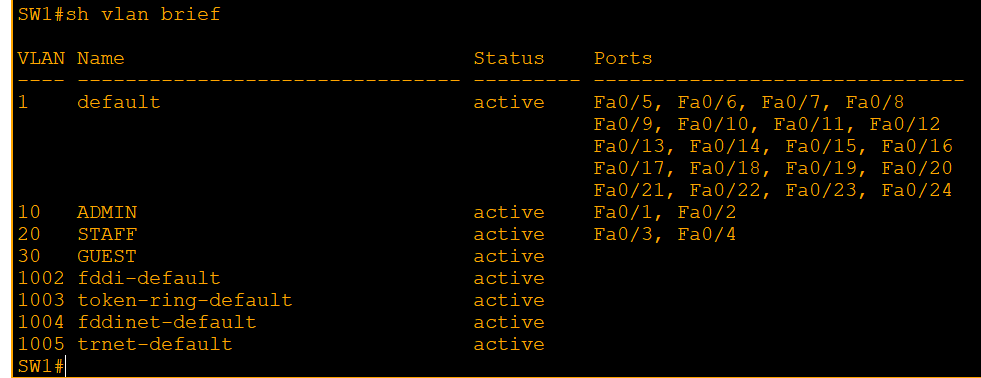
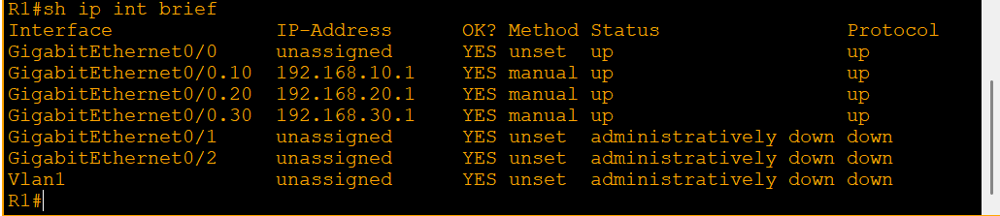
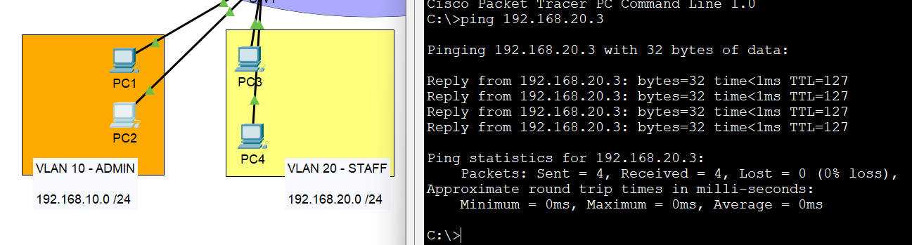
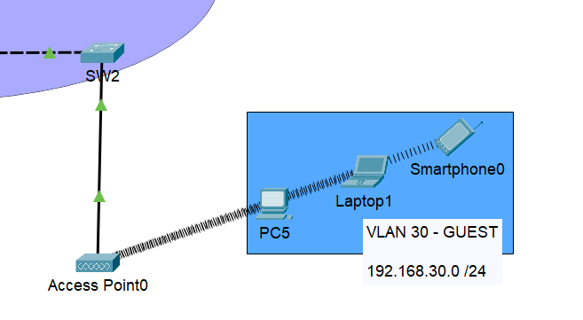
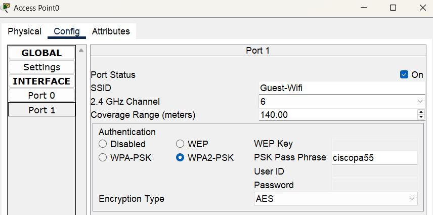
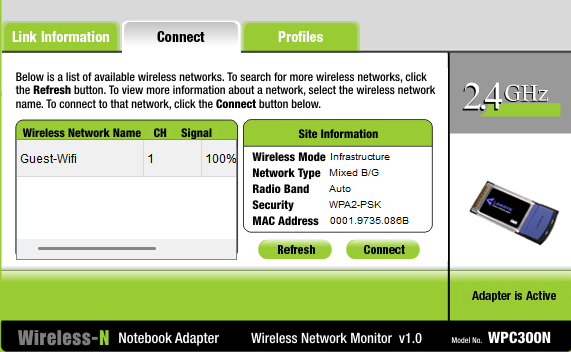
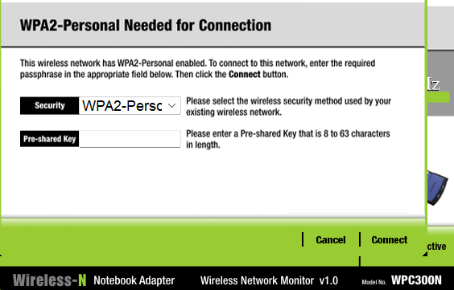

# Small-Office-Network-Setup
**Configured VLAN segmentation, DHCP, and Wi-Fi setup for a secure small office environment using Cisco Packet Tracer.**

**To open this project lab: Download the .pkt file and open it using Cisco Packet Tracer.**
## Project Overview
A comprehensive Packet Tracer project demonstrating core networking concepts, including:  
- VLANs (Virtual Land Area Networks)  
- Inter-VLAN Routing  
- DHCP (Dynamic Host Configuration Protocol)   
- Wifi Setup

This project demonstrates the configuration of a **small office network** with VLANs, Inter-Vlan routing, DHCP, and basic Wi-Fi setup.  
The goal is to design and implement a simple yet functional network that supports multiple departments while ensuring segmentation and connectivity.

## Brief Description of the used concepts and the Roles they play in the network
1. **VLANs (Virtual land Area Networks)**
- **Purpose:** Segment a network into smaller, isolated segments (VLANs) to improve organization, security, and management.
- **Role:** VLANs act as separate networks, allowing devices within a VLAN to communicate with each other but not with devices in other VLANs without routing.

2. **Routing Configuration**
- **Purpose:** Enable communication between VLANs and other networks.
- **Role:** Routers connect multiple VLANs and networks, allowing devices to communicate with each other across different VLANs.

3. **DHCP (Dynamic Host Configuration Protocol) Configuration**
- **Purpose:** Automatically assign IP addresses to devices on a network.
- **Role:** DHCP servers assign IP addresses, subnet masks, default gateways, and other network settings to devices, eliminating the need for manual configuration.

## Tools used for this Lab
- Cisco Packet Tracer  
- Virtual Studio Code Terminal (for documentation editing)  

## Network Topology
| Device | Quantity | Purpose |
|---------|--------|------------------|
|Router (Cisco 2911)| 1 | Inter-VLAN Routing, DHCP & ACLs Configurations |
|Switches (Cisco Catalyst 2960)| 2 | Connect end devices, assign VLANs, forward traffic to trunk uplinks
|Access Point | 1 | Connect end devies thru wireless|
|Personal Computers | 5 | End devices |
|Laptops | 1 | End devices |
|Smart Phone | 1 | End devices |

## IP Address Scheme
| VLAN |	Subnet |	Gateway |	DHCP Range |
|-----------------|----------------|--------------|---------------------|
|VLAN 10(ADMIN)|192.168.10.0/24|192.168.10.1|	192.168.10.2 - 192.168.10.254|
|VLAN 20 (STAFF)|	192.168.20.0/24|192.168.20.1|	192.168.20.2 - 192.168.20.254|
|VLAN 30 (GUEST)|	192.168.30.0/24|	192.168.30.1|	192.168.30.2 - 192.168.30.254|

# Step-by-Step Configuration of the Simulated Network in Cisco Packet Tracer

## STEP 1: Network Design
### Open Cisco Packet Tracer and Set Up the Topology
- Launch Cisco Packet Tracer.
On the open blank space: 
- Click "End Devices" > click and drop 8 Laptops into the setup 
- Click "Switches" under Networking devices > click and drop:
    - 2 Access Switches (2960-24TT)
- Click "Routers" under Networking devices> click and drop Router (2911)

## STEP 2: Physically connect the devices 
Use the “Connections” lightning icon on the left:
Choose "first cable" to automatically choose connection type for the devices (Switches and end devices connection) 

**Connect:**
Each PC to a port on an Access Switch 
   - PC1 & PC2 to Switch 1
   - PC3 & PC4 to Switch 1 
   - 1 Access Point to Switch 2

**Connect:** 
Switch 1 to Switch 2 using a Copper Cross-Over cable 
   - Switch 1 - Gig0/2  to Switch 2 - Gig0/2

**Connect:** 
Switch 1 to the Router using a copper straight-through cable 
   - Router - (Gig0/0) to Switch 1  - (Gig0/1)

## STEP 3: Turn on the Switches 
 - Click on the Multilayer Switch 

## STEP 4: Create VLANs and assign ports on the Switches 
### i. Create VLAN 10, 20, and 30 on Switch 1

- click on the Switch 1 device
- enter into the CLI

```bash
Switch 1# configure terminal
Switch 1(config)# vlan 10
Switch 1(config-vlan)# name ADMIN
Switch 1(config-vlan)# exit
```

```bash
Switch 1# configure terminal
Switch 1(config)# vlan 20
Switch 1(config-vlan)# name STAFF
Switch 1(config-vlan)# exit
```

```bash
Switch 1# configure terminal
Switch 1(config)# vlan 30
Switch 1(config-vlan)# name GUEST
Switch 1(config-vlan)# exit
```
### Assign Ports to VLAN 10 (Fa0/1-F0/2)

```bash
Switch 1# configure terminal
Switch 1(config)# int range fa0/1 - 2
Switch 1(config-if-range)# switchport mode access
Switch 1(config-if-range)# switchport access vlan 10
Switch 1(config-if-range)# exit
```
### Assign Ports to VLAN 20 (Fa0/3-F0/4)

```bash
Switch 1# configure terminal
Switch 1(config)# int range fa0/3 - 4
Switch 1(config-if-range)# switchport mode access
Switch 1(config-if-range)# switchport access vlan 20
Switch 1(config-if-range)# exit
```

### ii. Create VLAN 30 on Switch 2

- click on the Switch 2 device
- enter into the CLI

```bash
Switch 2# configure terminal
Switch 2(config)# vlan 30
Switch 2(config-vlan)# name GUEST
Switch 2(config-vlan)# exit
```
### Assign Ports to VLAN 30 (Fa0/1)

```bash
Switch 2# configure terminal
Switch 2(config)# int fa0/1
Switch 2(config-if)# switchport mode access
Switch 2(config-if)# switchport access vlan 10
Switch 2(config-if)# exit
```

### iii. Configure Trunk on the Router
We need to trunk the VLANs to the router so it can receive and route traffic for all VLANs using a single physical link.


```bash
Switch 1# configure terminal
Switch 1(config)# int g0/1
Switch 1(config-if)# switchport mode trunk
Switch 1(config-if)# switchport trunk allowed vlan 10,20,30
Switch 1(config-if)# exit
```

## STEP 5: Configure Router Subinterfaces for Inter-VLAN Routing

Identify the interface connected to the router (Gig0/1)

```bash
Router> enable
Router# configure terminal
Router(config)# int gig0/1
Router(config-if)# no shutdown
Router(config-if)# exit
```

### Create Subinterface according to the VLAN IDs (10, 20, 30)
- Router CLI
### VLAN 10 Subinterface

```bash
Router(config)# int gig0/1.10
Router(config-subif)# encapsulation dot1Q 10
Router(config-subif)# ip address 192.168.10.1 255.255.255.0
```

### VLAN 20 Subinterface

```bash
Router(config)# int gig0/1.20
Router(config-subif)# encapsulation dot1Q 20
Router(config-subif)# ip address 192.168.20.1 255.255.255.0
```

### VLAN 30 Subinterface

```bash
Router(config)# int gig0/1.30
Router(config-subif)# encapsulation dot1Q 30
Router(config-subif)# ip address 192.168.30.1 255.255.255.0
```

## STEP 6: Create DHCP Pools on the Router CLI
This will automatically assign ip addresses to the devices on the network


### Operations VLAN 10 Pool

```bash
Router(config)# service dhcp
Router(config)# ip dhcp pool ADMIN
Router(dhcp-config)# network 192.168.10.0 255.255.255.0
Router(dhcp-config)# default-router 192.168.10.1
Router(dhcp-config)# dns-server 8.8.8.8
Router(dhcp-config)# domain-name michaelangelotech.com
Router(dhcp-config)# exit
```

### Finance VLAN 20 Pool

```bash
Router(config)# service dhcp
Router(config)# ip dhcp pool STAFF
Router(dhcp-config)# network 192.168.20.0 255.255.255.0
Router(dhcp-config)# default-router 192.168.20.1
Router(dhcp-config)# dns-server 8.8.8.8
Router(dhcp-config)# domain-name michaelangelotech.com
Router(dhcp-config)# exit
```

### HR VLAN 30 Pool

```bash
Router(config)# service dhcp
Router(config)# ip dhcp pool GUEST
Router(dhcp-config)# network 192.168.30.0 255.255.255.0
Router(dhcp-config)# default-router 192.168.30.1
Router(dhcp-config)# dns-server 8.8.8.8
Router(dhcp-config)# domain-name michaelangelotech.com
Router(dhcp-config)# exit
```

## STEP 7: Enable DHCP on End devices (Laptops) 


- Click Laptop > Desktop > IP Configuration
- Set to **DHCP** on all devices in the set-up

## STEP 8: Test Inter-VLAN Routing by Pinging devices across VLANs


Click on the laptop device > Choose Desktop > Command Line

```bash
ping 192.168.10.2
ping 192.168.20.3
```
from Laptop 1
from pc1
from pc3

Repeat for other any devices to test connectivity across the vlans.

## STEP 9: Connect Access Point to Switch 2


Click "Wireles Devices" under Networking devices > click and drop:

**Connect:** 
Access Point 1 to Switch 1 using a Copper Straight Through cable 
   - AP 1 F0/1 to Switch 1 F0/1

## STEP 10: Set up SSID and Password on the Access Point


Click "Access Point"
On Port 1: set up your SSDI by clicking the panel box. 

To set a password click the **WPA-2-PSK** from the Authentication section and enter or put your password on the **PSK Pass Phrase box**

## STEP 11: Connect Wifi to wireless devices



Go to laptop > click **PC Wireless** > look for the Wifi SSID > Connect > enter the wifi password using the **PSK Pass Phrase box**


